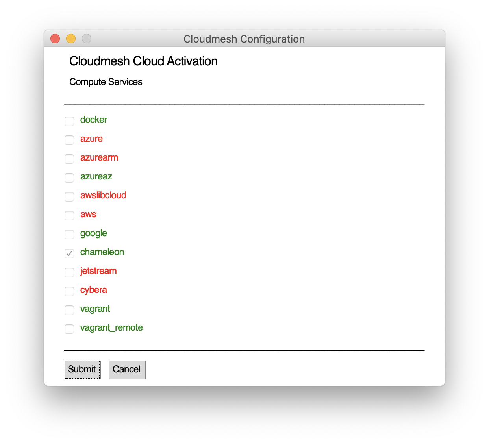

Documentation
=============


[](https://travis-ci.org/TankerHQ/cloudmesn-bar)

[](https://pypi.org/project/cloudmesh-bar)

[](https://pypi.org/project/cloudmesh-bar/)

[](https://github.com/TankerHQ/python-cloudmesh-bar/blob/master/LICENSE)

see cloudmesh.cmd5

* https://github.com/cloudmesh/cloudmesh.cmd5


This component allows you to edit the cloudmesh.yaml file via a simple 
GUI form.

The manual page is

      gui activate
      gui profile
      gui cloud CLOUD [--show]
      gui edit KEY [--show]

If you use --show the passwords are shown in the form otherwise they are
blended out with a * 

For cloudmesh to work you need to edit

* the profile
* activate the cloud you like to use
* and add things such as usernames, passwords and other parameters

Next we provide some examples to achive these tasks and include a
screenshot:

    
```bash    
cms gui profile
```    
    
    

    
```bash
cms gui activate
```

    


```bash
cms gui edit cloud.chameleon.credentials
```

or

```bash
cms gui cloud chameleon
```


    
